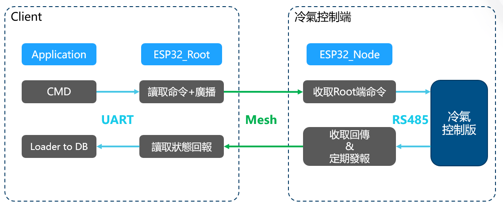

# Air Conditioning Control System

This project aims to implement control of air conditioning within a specific area using mesh wireless transmission and RS485 protocol. Through the integration of InfluxDB and Grafana, the system achieves data storage and visualization.

## Usage

1. **Deploy InfluxDB and Grafana:**
   - Start the InfluxDB and Grafana services using the following command:
     ```bash
     docker-compose up -d
     ```

2. **Use `loader_from_root.py`:**
   - Utilize the `loader_from_root.py` script to send commands and read values into the database. Ensure that you have configured the serial communication and mesh network settings correctly.
     ```bash
     python loader_from_root.py
     ```

## Notes

- Before using, make sure Docker and Docker Compose are correctly installed.
- When using `loader_from_root.py`, ensure that the serial communication settings are configured correctly.

## Technical Architecture

- **Mesh Transmission:** Uses a esp mesh network for the transmission of air conditioning commands.
- **RS485:** Implements control of air conditioning through the RS485 communication protocol.
- **InfluxDB:** Used for data storage and management.
- **Grafana:** Provides real-time visualization of data.



## Contribution

Your participation and contributions are welcome! Please submit issues or pull requests to enhance and improve this project.

## Contact Us

If you have any questions or suggestions, feel free to reach out. We are happy to address your inquiries.
